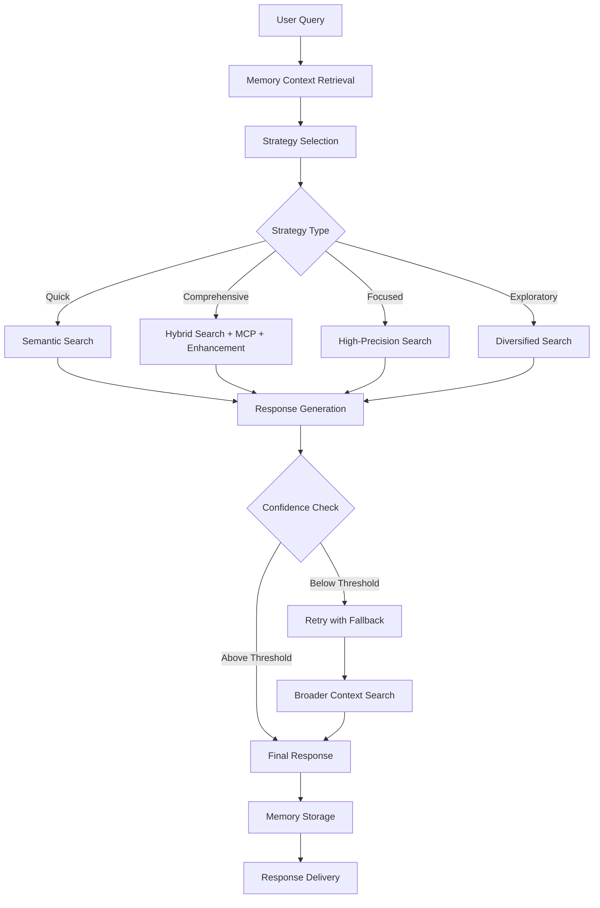

# 🤖 LegalizeMe AI Agent Architecture

## Overview

The LegalizeMe platform features an intelligent Legal Research Agent that provides sophisticated legal research capabilities with agentic behavior, memory, and intelligent chaining logic. This document outlines the architecture, components, and orchestration logic.

## 🏗️ Architecture Components

### Core Agent Class: `LegalResearchAgent`

The `LegalResearchAgent` is the central orchestrator that coordinates multiple services to provide intelligent legal research capabilities.

```python
from app.agents.legal_research_agent import LegalResearchAgent, ResearchStrategy

# Initialize agent
agent = LegalResearchAgent(redis_url="redis://localhost:6379")

# Perform research
result = await agent.run_research(
    query="What are employment rights in Kenya?",
    strategy=ResearchStrategy.COMPREHENSIVE,
    user_id="user123"
)
```

### Service Integration

The agent integrates the following services:

1. **LegalRAGService** - Enhanced RAG with hybrid retrieval
2. **IntelligenceEnhancer** - AI-powered response enhancement
3. **MCPService** - Multi-source content processing
4. **VectorService** - Vector similarity search
5. **AIService** - Core AI model interactions

## 🧠 Research Strategies

### 1. Quick Strategy (`ResearchStrategy.QUICK`)
- **Use Case**: Fast responses for simple queries
- **Behavior**: 
  - Uses semantic retrieval only
  - Limits sources to 3 for speed
  - Direct response generation
- **Processing Time**: ~1-2 seconds

### 2. Comprehensive Strategy (`ResearchStrategy.COMPREHENSIVE`)
- **Use Case**: In-depth legal research (default)
- **Behavior**:
  - Hybrid retrieval (semantic + keyword)
  - MCP service integration for additional sources
  - Intelligence enhancement
  - Multi-step reasoning chain
- **Processing Time**: ~3-5 seconds

### 3. Focused Strategy (`ResearchStrategy.FOCUSED`)
- **Use Case**: Specific legal questions requiring precision
- **Behavior**:
  - High-relevance source filtering (≥0.8 relevance score)
  - Semantic retrieval with precision focus
  - Limited to most relevant sources
- **Processing Time**: ~2-3 seconds

### 4. Exploratory Strategy (`ResearchStrategy.EXPLORATORY`)
- **Use Case**: Broad legal discovery and research
- **Behavior**:
  - Expanded source collection
  - Source diversification by document type
  - Broader context analysis
- **Processing Time**: ~4-6 seconds

## 🔄 Orchestration Logic

### Research Pipeline



### Chaining Logic

1. **Retrieve** → Search relevant legal documents
2. **Summarize** → Extract key information from sources
3. **Synthesize** → Combine information intelligently
4. **Respond** → Generate comprehensive answer
5. **Validate** → Check confidence and retry if needed

## 🧠 Memory System

### AgentMemory Class

The agent features a sophisticated memory system that supports both local and Redis-based storage:

```python
class AgentMemory:
    def __init__(self, redis_url=None, max_memory_size=100):
        # Supports both local and Redis storage
        
    async def store_query(self, user_id, query, context, result=None):
        # Store query with user isolation
        
    async def get_related_queries(self, user_id, current_query, limit=5):
        # Find related queries using similarity
```

### Memory Features

- **User Isolation**: Each user's memory is completely isolated
- **Query Similarity**: Finds related queries using keyword similarity
- **Context Enhancement**: Uses previous queries to improve current responses
- **Automatic Cleanup**: Maintains memory size limits and expiration
- **Redis Support**: Optional Redis backend for scalability

## 📊 Confidence & Fallback System

### Confidence Scoring

- **Sources**: Based on relevance scores and document quality
- **Model Confidence**: AI model's confidence in the response
- **Retrieval Quality**: Quality of retrieved documents
- **Combined Score**: Weighted combination of all factors

### Fallback Logic

```python
if confidence < threshold:
    # 1. Retry with broader context from memory
    # 2. Use comprehensive strategy as fallback
    # 3. Expand source collection
    # 4. Apply intelligence enhancement
```

## 🔌 API Integration

### Counsel Query Enhancement

The existing `/counsel/query` endpoint supports agent mode:

```javascript
const request = {
  query: "Legal question",
  agent_mode: true,  // Enable agent behavior
  use_enhanced_rag: true
};
```

### Dedicated Agent Endpoint

The new `/agents/research` endpoint provides full agent capabilities:

```javascript
const request = {
  query: "Legal question",
  strategy: "comprehensive",
  top_k: 5,
  confidence_threshold: 0.7
};
```

## 🎯 Response Enhancement

### Intelligent Features

1. **Reasoning Chain**: Step-by-step reasoning process
2. **Follow-up Suggestions**: Context-aware suggestions
3. **Related Queries**: Intelligent query recommendations
4. **Citation Quality**: Enhanced legal citations
5. **Confidence Metrics**: Transparent confidence scoring

### Response Structure

```python
@dataclass
class AgenticResearchResponse:
    answer: str
    confidence: float
    citations: List[LegalSource]
    retrieval_strategy: str
    research_strategy: ResearchStrategy
    metadata: AgentMetadata
    reasoning_chain: List[str]
    follow_up_suggestions: List[str]
    related_queries: List[str]
```

## 🔧 Configuration & Deployment

### Environment Variables

```bash
# Optional Redis for memory
REDIS_URL=redis://localhost:6379

# AWS Bedrock models
AWS_BEDROCK_MODEL_ID_PRIMARY=us.anthropic.claude-sonnet-4-20250514-v1:0
AWS_BEDROCK_MODEL_ID_SECONDARY=us.anthropic.claude-3-7-sonnet-20250219-v1:0
AWS_BEDROCK_MODEL_ID_FALLBACK=mistral.mistral-large-2402-v1:0
```

### Agent Initialization

```python
# With Redis memory
agent = LegalResearchAgent(redis_url=settings.REDIS_URL)

# Local memory only
agent = LegalResearchAgent()

# Initialize services
await agent.initialize()
```

## 📈 Performance Metrics

### Tracked Metrics

- **Total Queries**: Number of queries processed
- **Success Rate**: Percentage of successful queries
- **Average Confidence**: Mean confidence score
- **Processing Time**: Average response time
- **Strategy Usage**: Usage statistics per strategy
- **Memory Usage**: Memory system utilization
- **Fallback Rate**: Frequency of fallback usage

### Health Monitoring

```python
# Agent health check
health = await agent.health_check()

# Performance metrics
metrics = agent.get_metrics()

# Memory statistics
memory_stats = await agent.get_user_memory_summary(user_id)
```

## 🚀 Future Enhancements

### Planned Features

1. **Multi-turn Conversations**: Enhanced context awareness
2. **Legal Entity Recognition**: Advanced NLP for legal entities
3. **Case Law Analysis**: Specialized case law processing
4. **Regulatory Updates**: Real-time regulatory change detection
5. **Collaborative Research**: Multi-agent collaboration

### Scalability Considerations

- **Horizontal Scaling**: Multiple agent instances
- **Load Balancing**: Request distribution
- **Caching**: Response and memory caching
- **Async Processing**: Non-blocking operations

---

## 📚 Additional Resources

- [Enhanced RAG Integration Guide](./ENHANCED_RAG_INTEGRATION.md)
- [API Documentation](http://counsel-alb-694525771.us-east-1.elb.amazonaws.com/docs)
- [Frontend Integration Examples](./ENHANCED_RAG_INTEGRATION.md#frontend-integration)

For technical support or questions about the agent architecture, please refer to the comprehensive test suite in `tests/agents/` or contact the development team.
